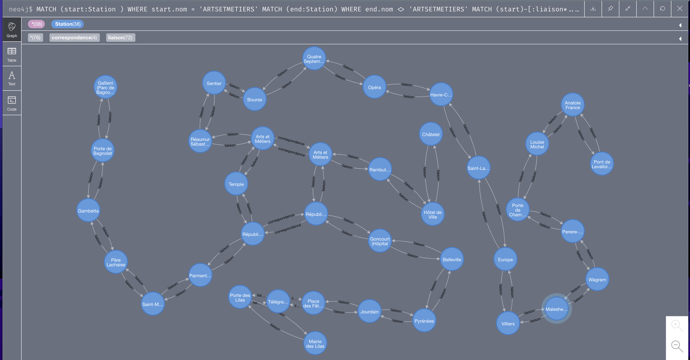

# Evaluation

A docker compose is given, it will start two different services, the `Neo4j` one and the `API`. Please ensure you don't
have any running containers / application on ports: `8200`, `7474` and `7687`. 

To start the servicesn run `docker-compose up -d`

## Create Objects

You don't have to run this part of objects creation as it's done on the api container startup. but they here to show what they did. 

### Create Nodes / Stations

The query that create the stations.

```cypher
LOAD CSV WITH HEADERS FROM 'https://raw.githubusercontent.com/pauldechorgnat/cool-datasets/master/ratp/stations.csv' AS row
CREATE (:Station {
                    id: row.nom_clean + "-" + row.ligne, 
                    nom:row.nom_clean, 
                    nom_gare: row.nom_gare, 
                    ligne: row.ligne,
                    latitude: toFloat(row.x), 
                    longitude: toFloat(row.y),
                    trafic: toFloat(row.Trafic),
                    ville: row.Ville
});
```

### Create Liaison Relationship

The query that create liaison between each stations on the same line

```cypher
LOAD CSV WITH HEADERS FROM 'https://raw.githubusercontent.com/pauldechorgnat/cool-datasets/master/ratp/liaisons.csv' AS row
MATCH (f:Station {nom: row.start, ligne: row.ligne})
MATCH (t:Station {nom:  row.stop, ligne: row.ligne})
MERGE (f)-[:liaison {ligne: row.ligne, distance: sqrt((t.latitude - f.latitude)^2 + (t.longitude - f.longitude)^2)}]->(t)
RETURN f, t;

MATCH (:Station) -[r:liaison]->(:Station)
SET r.time = (r.distance / 1000 / 40)*60
RETURN r;
```

### Create Correspondence Relationship

The query that create the correspondence relation for each station from two different stations.

```cypher
LOAD CSV WITH HEADERS FROM 'https://raw.githubusercontent.com/pauldechorgnat/cool-datasets/master/ratp/liaisons.csv' AS row
MATCH (f:Station {nom: row.start}) WHERE f.ligne=row.ligne
MATCH (t:Station {nom: row.start}) WHERE t.ligne<>row.ligne
MERGE (f)-[:correspondance {ligne: t.ligne, distance: 266.666666, time: 4}]->(t)
RETURN f, t
```

### Afficher Lignes ARTS & METIERS

A test query to check the whole lines traversing `ARTS & METIERS` station.

```cypher
MATCH (start:Station ) WHERE start.nom = 'ARTSETMETIERS'
MATCH (end:Station) WHERE end.nom  <> 'ARTSETMETIERS'
MATCH (start)-[:liaison*..20]->(end:Station)
RETURN start, end
```



## Questions Answering

Below the answers of the given questions, for each you will find the query using cypher and its response. You can test
them easily by using the Neo4J Browser available at [Here](http://localhost:7474/browser/)

- Quel est le nombre de correspondances par station ?

```cypher
MATCH path = (from:Station)-[r:correspondance]->(to:Station)
RETURN from.nom, COUNT(DISTINCT r.ligne) as numberOfLines, COUNT(r.ligne) as totalOfCorrespondence, COLLECT(from.ligne + "->" + to.ligne) AS correspondences
ORDER BY numberOfLines DESC
```

```
╒══════════════════════════╤═══════════════╤═══════════════════════╤══════════════════════════════════════════════════════════════════════╕
│"from.nom"                │"numberOfLines"│"totalOfCorrespondence"│"correspondences"                                                     │
╞══════════════════════════╪═══════════════╪═══════════════════════╪══════════════════════════════════════════════════════════════════════╡
│"CHATELET"                │5              │20                     │["1->11","1->4","1->7","1->14","4->1","4->14","4->11","4->7","7->4","7│
│                          │               │                       │->1","7->11","7->14","11->1","11->4","11->14","11->7","14->4","14->1",│
│                          │               │                       │"14->11","14->7"]                                                     │
├──────────────────────────┼───────────────┼───────────────────────┼──────────────────────────────────────────────────────────────────────┤
│"REPUBLIQUE"              │5              │20                     │["3->9","3->11","3->8","3->5","5->3","5->11","5->8","5->9","8->11","8-│
│                          │               │                       │>9","8->5","8->3","9->5","9->3","9->8","9->11","11->8","11->5","11->3"│
│                          │               │                       │,"11->9"]                                                             │
├──────────────────────────┼───────────────┼───────────────────────┼──────────────────────────────────────────────────────────────────────┤
│"MONTPARNASSEBIENVENUE"   │4              │12                     │["4->13","4->6","4->12","6->4","6->12","6->13","12->6","12->4","12->13│
│                          │               │                       │","13->4","13->6","13->12"]                                           │
├──────────────────────────┼───────────────┼───────────────────────┼──────────────────────────────────────────────────────────────────────┤
│"NATION"                  │4              │12                     │["1->6","1->9","1->2","2->9","2->6","2->1","6->9","6->2","6->1","9->1"│
│                          │               │                       │,"9->6","9->2"]                                                       │
├──────────────────────────┼───────────────┼───────────────────────┼──────────────────────────────────────────────────────────────────────┤
│"STLAZARE"                │4              │12                     │["3->13","3->14","3->12","12->13","12->14","12->3","13->12","13->3","1│
│                          │               │                       │3->14","14->12","14->3","14->13"]                                     │
├──────────────────────────┼───────────────┼───────────────────────┼──────────────────────────────────────────────────────────────────────┤
│"BASTILLE"                │3              │6                      │["1->8","1->5","5->8","5->1","8->1","8->5"]                           │
├──────────────────────────┼───────────────┼───────────────────────┼──────────────────────────────────────────────────────────────────────┤
│"CHARLESDEGAULLEETOILE"   │3              │6                      │["1->2","1->6","2->6","2->1","6->2","6->1"]                           │
├──────────────────────────┼───────────────┼───────────────────────┼──────────────────────────────────────────────────────────────────────┤
│"CONCORDE"                │3              │6                      │["1->12","1->8","8->12","8->1","12->1","12->8"]                       │
├──────────────────────────┼───────────────┼───────────────────────┼──────────────────────────────────────────────────────────────────────┤
│"GAREDELEST"              │3              │6                      │["4->5","4->7","5->4","5->7","7->4","7->5"]                           │
├──────────────────────────┼───────────────┼───────────────────────┼──────────────────────────────────────────────────────────────────────┤
│"JAURES"                  │3              │6                      │["2->5","2->7bis","5->2","5->7bis","7bis->5","7bis->2"]               │
├──────────────────────────┼───────────────┼───────────────────────┼──────────────────────────────────────────────────────────────────────┤
│"LAMOTTEPICQUETGRENELLE"  │3              │6                      │["6->8","6->10","8->6","8->10","10->8","10->6"]                       │
├──────────────────────────┼───────────────┼───────────────────────┼──────────────────────────────────────────────────────────────────────┤
│"MADELEINE"               │3              │6                      │["8->12","8->14","12->14","12->8","14->8","14->12"]                   │
├──────────────────────────┼───────────────┼───────────────────────┼──────────────────────────────────────────────────────────────────────┤
│"OPERA"                   │3              │6                      │["3->7","3->8","7->8","7->3","8->3","8->7"]                           │
├──────────────────────────┼───────────────┼───────────────────────┼──────────────────────────────────────────────────────────────────────┤
│"PLACEDITALIE"            │3              │6                      │["5->6","5->7","6->5","6->7","7->5","7->6"]                           │
├──────────────────────────┼───────────────┼───────────────────────┼──────────────────────────────────────────────────────────────────────┤
│"STALINGRAD"              │3              │6                      │["2->7","2->5","5->7","5->2","7->5","7->2"]                           │
├──────────────────────────┼───────────────┼───────────────────────┼──────────────────────────────────────────────────────────────────────┤
│"STRASBOURGSTDENIS"       │3              │6                      │["4->9","4->8","8->9","8->4","9->4","9->8"]                           │
├──────────────────────────┼───────────────┼───────────────────────┼──────────────────────────────────────────────────────────────────────┤
│"ARTSETMETIERS"           │2              │2                      │["3->11","11->3"]                                                     │
├──────────────────────────┼───────────────┼───────────────────────┼──────────────────────────────────────────────────────────────────────┤
│"BARBESROCHECHOUART"      │2              │2                      │["2->4","4->2"]                                                       │
├──────────────────────────┼───────────────┼───────────────────────┼──────────────────────────────────────────────────────────────────────┤
│"BELLEVILLE"              │2              │2                      │["2->11","11->2"]                                                     │
├──────────────────────────┼───────────────┼───────────────────────┼──────────────────────────────────────────────────────────────────────┤
│"BERCY"                   │2              │2                      │["6->14","14->6"]                                                     │
├──────────────────────────┼───────────────┼───────────────────────┼──────────────────────────────────────────────────────────────────────┤
│"BONNENOUVELLE"           │2              │2                      │["8->9","9->8"]                                                       │
├──────────────────────────┼───────────────┼───────────────────────┼──────────────────────────────────────────────────────────────────────┤
│"CHAMPSELYSEESCLEMENCEAU" │2              │2                      │["1->13","13->1"]                                                     │
├──────────────────────────┼───────────────┼───────────────────────┼──────────────────────────────────────────────────────────────────────┤
│"CHAUSSEEDANTINLAFAYETTE" │2              │2                      │["7->9","9->7"]                                                       │
├──────────────────────────┼───────────────┼───────────────────────┼──────────────────────────────────────────────────────────────────────┤
│"DAUMESNIL"               │2              │2                      │["6->8","8->6"]                                                       │
├──────────────────────────┼───────────────┼───────────────────────┼──────────────────────────────────────────────────────────────────────┤
│"DENFERTROCHEREAU"        │2              │2                      │["4->6","6->4"]                                                       │
├──────────────────────────┼───────────────┼───────────────────────┼──────────────────────────────────────────────────────────────────────┤
│"DUROC"                   │2              │2                      │["10->13","13->10"]                                                   │
├──────────────────────────┼───────────────┼───────────────────────┼──────────────────────────────────────────────────────────────────────┤
│"FRANKLINDROOSEVELT"      │2              │2                      │["1->9","9->1"]                                                       │
├──────────────────────────┼───────────────┼───────────────────────┼──────────────────────────────────────────────────────────────────────┤
│"GAMBETTA"                │2              │2                      │["3->3bis","3bis->3"]                                                 │
├──────────────────────────┼───────────────┼───────────────────────┼──────────────────────────────────────────────────────────────────────┤
│"GAREDAUSTERLITZ"         │2              │2                      │["5->10","10->5"]                                                     │
├──────────────────────────┼───────────────┼───────────────────────┼──────────────────────────────────────────────────────────────────────┤
│"GAREDELYON"              │2              │2                      │["1->14","14->1"]                                                     │
├──────────────────────────┼───────────────┼───────────────────────┼──────────────────────────────────────────────────────────────────────┤
│"GAREDUNORD"              │2              │2                      │["4->5","5->4"]                                                       │
├──────────────────────────┼───────────────┼───────────────────────┼──────────────────────────────────────────────────────────────────────┤
│"GRANDSBOULEVARDS"        │2              │2                      │["8->9","9->8"]                                                       │
├──────────────────────────┼───────────────┼───────────────────────┼──────────────────────────────────────────────────────────────────────┤
│"HAVRECAUMARTIN"          │2              │2                      │["3->9","9->3"]                                                       │
├──────────────────────────┼───────────────┼───────────────────────┼──────────────────────────────────────────────────────────────────────┤
│"HOTELDEVILLE"            │2              │2                      │["1->11","11->1"]                                                     │
├──────────────────────────┼───────────────┼───────────────────────┼──────────────────────────────────────────────────────────────────────┤
│"INVALIDES"               │2              │2                      │["8->13","13->8"]                                                     │
├──────────────────────────┼───────────────┼───────────────────────┼──────────────────────────────────────────────────────────────────────┤
│"JUSSIEU"                 │2              │2                      │["7->10","10->7"]                                                     │
├──────────────────────────┼───────────────┼───────────────────────┼──────────────────────────────────────────────────────────────────────┤
│"LOUISBLANC"              │2              │2                      │["7->7bis","7bis->7"]                                                 │
├──────────────────────────┼───────────────┼───────────────────────┼──────────────────────────────────────────────────────────────────────┤
│"MARCADETPOISSONNIERS"    │2              │2                      │["4->12","12->4"]                                                     │
├──────────────────────────┼───────────────┼───────────────────────┼──────────────────────────────────────────────────────────────────────┤
│"MICHELANGEAUTEUIL"       │2              │2                      │["9->10","10->9"]                                                     │
├──────────────────────────┼───────────────┼───────────────────────┼──────────────────────────────────────────────────────────────────────┤
│"MICHELANGEMOLITOR"       │2              │2                      │["9->10","10->9"]                                                     │
├──────────────────────────┼───────────────┼───────────────────────┼──────────────────────────────────────────────────────────────────────┤
│"MIROMESNIL"              │2              │2                      │["9->13","13->9"]                                                     │
├──────────────────────────┼───────────────┼───────────────────────┼──────────────────────────────────────────────────────────────────────┤
│"OBERKAMPF"               │2              │2                      │["5->9","9->5"]                                                       │
├──────────────────────────┼───────────────┼───────────────────────┼──────────────────────────────────────────────────────────────────────┤
│"ODEON"                   │2              │2                      │["4->10","10->4"]                                                     │
├──────────────────────────┼───────────────┼───────────────────────┼──────────────────────────────────────────────────────────────────────┤
│"PALAISROYALMUSEEDULOUVRE"│2              │2                      │["1->7","7->1"]                                                       │
├──────────────────────────┼───────────────┼───────────────────────┼──────────────────────────────────────────────────────────────────────┤
│"PASTEUR"                 │2              │2                      │["6->12","12->6"]                                                     │
├──────────────────────────┼───────────────┼───────────────────────┼──────────────────────────────────────────────────────────────────────┤
│"PERELACHAISE"            │2              │2                      │["2->3","3->2"]                                                       │
├──────────────────────────┼───────────────┼───────────────────────┼──────────────────────────────────────────────────────────────────────┤
│"PIGALLE"                 │2              │2                      │["2->12","12->2"]                                                     │
├──────────────────────────┼───────────────┼───────────────────────┼──────────────────────────────────────────────────────────────────────┤
│"PLACEDECLICHY"           │2              │2                      │["2->13","13->2"]                                                     │
├──────────────────────────┼───────────────┼───────────────────────┼──────────────────────────────────────────────────────────────────────┤
│"PLACEDESFETES"           │2              │2                      │["11->7bis","7bis->11"]                                               │
├──────────────────────────┼───────────────┼───────────────────────┼──────────────────────────────────────────────────────────────────────┤
│"PORTEDESLILAS"           │2              │2                      │["11->3bis","3bis->11"]                                               │
├──────────────────────────┼───────────────┼───────────────────────┼──────────────────────────────────────────────────────────────────────┤
│"PYRAMIDES"               │2              │2                      │["7->14","14->7"]                                                     │
├──────────────────────────┼───────────────┼───────────────────────┼──────────────────────────────────────────────────────────────────────┤
│"RASPAIL"                 │2              │2                      │["4->6","6->4"]                                                       │
├──────────────────────────┼───────────────┼───────────────────────┼──────────────────────────────────────────────────────────────────────┤
│"REAUMURSEBASTOPOL"       │2              │2                      │["3->4","4->3"]                                                       │
├──────────────────────────┼───────────────┼───────────────────────┼──────────────────────────────────────────────────────────────────────┤
│"REUILLYDIDEROT"          │2              │2                      │["1->8","8->1"]                                                       │
├──────────────────────────┼───────────────┼───────────────────────┼──────────────────────────────────────────────────────────────────────┤
│"RICHELIEUDROUOT"         │2              │2                      │["8->9","9->8"]                                                       │
├──────────────────────────┼───────────────┼───────────────────────┼──────────────────────────────────────────────────────────────────────┤
│"SEVRESBABYLONE"          │2              │2                      │["10->12","12->10"]                                                   │
├──────────────────────────┼───────────────┼───────────────────────┼──────────────────────────────────────────────────────────────────────┤
│"TROCADERO"               │2              │2                      │["6->9","9->6"]                                                       │
├──────────────────────────┼───────────────┼───────────────────────┼──────────────────────────────────────────────────────────────────────┤
│"VILLIERS"                │2              │2                      │["2->3","3->2"]                                                       │
└──────────────────────────┴───────────────┴───────────────────────┴──────────────────────────────────────────────────────────────────────┘
```

- Quel est le nombre de stations à moins de deux kilomètres de la station LADEFENSE (on pourra prendre la distance brute
  sans considération de relation) ?

```cypher
MATCH (start: Station {nom: 'LADEFENSE'})
MATCH (end: Station) WHERE end.nom <> 'LADEFENSE'
MATCH  path = (start)-[*1..15]->(end)
WITH [r in relationships(path) | r.ligne] AS lignes, [n in nodes(path) | n.nom_gare + "(" + n.ligne + ")"] AS stations, start.nom as start, end.nom as end, REDUCE(total=0, r in relationships(path) | total + r.distance) AS totalDistance
WHERE totalDistance <= 2000 AND start <> end
RETURN start, end, lignes, totalDistance, stations
ORDER BY totalDistance ASC;
```

```
╒═══════════╤══════════════════════╤═════════╤══════════════════╤══════════════════════════════════════════════════════════════════════╕
│"start"    │"end"                 │"lignes" │"totalDistance"   │"stations"                                                            │
╞═══════════╪══════════════════════╪═════════╪══════════════════╪══════════════════════════════════════════════════════════════════════╡
│"LADEFENSE"│"ESPLANADEDELADEFENSE"│["1"]    │892.6592814735163 │["La Défense - Grande Arche(1)","Esplanade de la Défense(1)"]         │
├───────────┼──────────────────────┼─────────┼──────────────────┼──────────────────────────────────────────────────────────────────────┤
│"LADEFENSE"│"PONTDENEUILLY"       │["1","1"]│1913.2858186011879│["La Défense - Grande Arche(1)","Esplanade de la Défense(1)","Pont de │
│           │                      │         │                  │Neuilly (Avenue de Madrid)(1)"]                                       │
└───────────┴──────────────────────┴─────────┴──────────────────┴──────────────────────────────────────────────────────────────────────┘
```

- Combien de temps faut-il pour aller en metro de LADEFENSE à CHATEAUDEVINCENNES ?

```cypher
MATCH (start: Station {nom: 'LADEFENSE'})
MATCH (end: Station {nom: 'CHATEAUDEVINCENNES'})
MATCH  path = (start)-[:liaison*1..30]->(end)
WITH start.nom as start, end.nom as end, 
[n in nodes(path) | n.nom_gare] AS stations,
REDUCE(total=0, r in relationships(path) | total + r.distance) AS totalDistance
WITH ((totalDistance / 1000) / 40) * 60 AS duree_minutes, start, end, stations
RETURN start, end, stations, duree_minutes
```

Ou en utilisant la propriété `Time`

```cypher
MATCH (start: Station {nom: 'LADEFENSE'})
MATCH (end: Station {nom: 'CHATEAUDEVINCENNES'})
MATCH  path = (start)-[:liaison*1..30]->(end)
WITH start.nom as start, end.nom as end, 
[n in nodes(path) | n.nom_gare] AS stations,
REDUCE(total=0, r in relationships(path) | total + r.time) AS totalTime
RETURN start, end, stations, totalTime
```

```
╒═══════════╤════════════════════╤══════════════════════════════════════════════════════════════════════╤═════════════════╕
│"start"    │"end"               │"stations"                                                            │"totalTime"      │
╞═══════════╪════════════════════╪══════════════════════════════════════════════════════════════════════╪═════════════════╡
│"LADEFENSE"│"CHATEAUDEVINCENNES"│["La Défense - Grande Arche","Esplanade de la Défense","Pont de Neuill│24.67955722849312│
│           │                    │y (Avenue de Madrid)","Les Sablons (Jardin d'acclimatation)","Porte Ma│                 │
│           │                    │illot","Argentine","Charles de Gaulle-Étoile","George-V","Franklin D.R│                 │
│           │                    │oosevelt","Champs-Élysées-Clémenceau","Concorde","Tuileries","Palais R│                 │
│           │                    │oyal-Musée du Louvre","Louvre-Rivoli","Châtelet","Hôtel de Ville","Sai│                 │
│           │                    │nt-Paul (le Marais)","Bastille","Gare de Lyon","Reuilly-Diderot","Nati│                 │
│           │                    │on","Porte de Vincennes","Saint-Mandé","Bérault","Château de Vincennes│                 │
│           │                    │"]                                                                    │                 │
└───────────┴────────────────────┴──────────────────────────────────────────────────────────────────────┴─────────────────┘

```

- Combien de temps faut-il pour aller à pied de LADEFENSE à CHATEAUDEVINCENNES (on pourra considérer que tout le chemin
  se fait à pied, sans considération de relation) ?

```cypher
MATCH (start: Station {nom: 'LADEFENSE'})
MATCH (end: Station {nom: 'CHATEAUDEVINCENNES'})
MATCH  path = (start)-[:liaison*1..30]->(end)
WITH start.nom as start, end.nom as end, 
[n in nodes(path) | n.nom_gare] AS stations,
REDUCE(total=0, r in relationships(path) | total + r.distance) AS totalDistance
WITH ((totalDistance / 1000) / 4)  AS duree, start, end, stations
RETURN start, end, stations, duree
```

```
╒═══════════╤════════════════════╤══════════════════════════════════════════════════════════════════════╤═════════════════╕
│"start"    │"end"               │"stations"                                                            │"duree en heure" │
╞═══════════╪════════════════════╪══════════════════════════════════════════════════════════════════════╪═════════════════╡
│"LADEFENSE"│"CHATEAUDEVINCENNES"│["La Défense - Grande Arche","Esplanade de la Défense","Pont de Neuill│4.11325953       │
│           │                    │y (Avenue de Madrid)","Les Sablons (Jardin d'acclimatation)","Porte Ma│                 │
│           │                    │illot","Argentine","Charles de Gaulle-Étoile","George-V","Franklin D.R│                 │
│           │                    │oosevelt","Champs-Élysées-Clémenceau","Concorde","Tuileries","Palais R│                 │
│           │                    │oyal-Musée du Louvre","Louvre-Rivoli","Châtelet","Hôtel de Ville","Sai│                 │
│           │                    │nt-Paul (le Marais)","Bastille","Gare de Lyon","Reuilly-Diderot","Nati│                 │
│           │                    │on","Porte de Vincennes","Saint-Mandé","Bérault","Château de Vincennes│                 │
│           │                    │"]                                                                    │                 │
└───────────┴────────────────────┴──────────────────────────────────────────────────────────────────────┴─────────────────┘
```

- Est-il plus rapide de faire un changement à SAINTLAZARE pour aller de MONTPARNASSEBIENVENUE à GABRIELPERI ?

```cypher
MATCH (start: Station {nom: 'MONTPARNASSEBIENVENUE'})
MATCH (end: Station {nom: 'GABRIELPERI'})
MATCH  path = (start)-[:liaison*1..20]->(end)
WITH start.nom as start, end.nom as end, 
[n in nodes(path) | n.nom_gare + "(" + n.ligne + ")"] AS stations,
REDUCE(total=0, r in relationships(path) | total + r.time) AS duree_minutes
RETURN start, end, stations, duree_minutes, SIZE(stations) as NumberOfStations
ORDER BY duree_minutes ASC
LIMIT 1

╒═══════════════════════╤═════════════╤══════════════════════════════════════════════════════════════════════╤══════════════════╤══════════════════╕
│"start"                │"end"        │"stations"                                                            │"duree_minutes"   │"NumberOfStations"│
╞═══════════════════════╪═════════════╪══════════════════════════════════════════════════════════════════════╪══════════════════╪══════════════════╡
│"MONTPARNASSEBIENVENUE"│"GABRIELPERI"│["Montparnasse-Bienvenüe(13)","Duroc(13)","Saint-François-Xavier(13)",│14.623356006031889│15                │
│                       │             │"Varenne(13)","Invalides(13)","Champs-Élysées-Clémenceau(13)","Miromes│                  │                  │
│                       │             │nil(13)","Saint-Lazare(13)","Liège(13)","Place de Clichy(13)","La Four│                  │                  │
│                       │             │che(13)","Brochant(13)","Porte de Clichy(13)","Mairie de Clichy(13)","│                  │                  │
│                       │             │Gabriel Péri-Asnières-Gennevilliers(13)"]                             │                  │                  │
└───────────────────────┴─────────────┴──────────────────────────────────────────────────────────────────────┴──────────────────┴──────────────────┘
```

```cypher
MATCH (start: Station {nom: 'MONTPARNASSEBIENVENUE'})
MATCH (correspondance: Station {nom: 'STLAZARE'})
MATCH (end: Station {nom: 'GABRIELPERI'})
MATCH  path = (start)-[:liaison*1..10]->(:Station)-[:correspondance*1..1]->(correspondance)-[:liaison*0..8]->(end)
WITH start.nom as start, end.nom as end, 
[n in nodes(path) | n.nom_gare + "(" + n.ligne + ")"] AS stations,
REDUCE(total=0, r in relationships(path) | total + r.distance) AS totalDistance
WITH ((totalDistance / 1000) / 40) * 60 AS duree_minutes, start, end, stations
RETURN start, end, stations, duree_minutes
ORDER BY duree_minutes ASC;

╒═══════════════════════╤═════════════╤══════════════════════════════════════════════════════════════════════╤══════════════════╕
│"start"                │"end"        │"stations"                                                            │"duree_minutes"   │
╞═══════════════════════╪═════════════╪══════════════════════════════════════════════════════════════════════╪══════════════════╡
│"MONTPARNASSEBIENVENUE"│"GABRIELPERI"│["Montparnasse-Bienvenüe(12)","Notre-Dame-des-Champs(12)","Rennes(12)"│18.418527443998396│
│                       │             │,"Sèvres-Babylone(12)","Rue du Bac(12)","Solférino(12)","Assemblée Nat│                  │
│                       │             │ionale(12)","Concorde(12)","Madeleine(12)","Saint-Lazare(12)","Saint-L│                  │
│                       │             │azare(13)","Liège(13)","Place de Clichy(13)","La Fourche(13)","Brochan│                  │
│                       │             │t(13)","Porte de Clichy(13)","Mairie de Clichy(13)","Gabriel Péri-Asni│                  │
│                       │             │ères-Gennevilliers(13)"]                                              │                  │
└───────────────────────┴─────────────┴──────────────────────────────────────────────────────────────────────┴──────────────────┘

```

La réponse est donc oui, car il est plus rapide de passer par STLAZAR, puisque ça prendra moins de temps.

- Combien de stations se trouvent dans un rayon de 10 stations par train autour de SAINTLAZARE ?

```cypher
MATCH (start: Station {nom: 'STLAZARE'})
MATCH (end: Station) WHERE end.nom <> 'STLAZARE'
MATCH  path = (start)-[:liaison*10..10]->(:Station)-[:correspondance*0..3]->(:Station)-[:liaison*0..3]->(end)
WITH path, start, end
UNWIND NODES(path) as nodes
WITH SIZE(COLLECT(DISTINCT nodes.id)) AS uniqueLength, SIZE(COLLECT(nodes.id)) AS length, start, end, path
WHERE  uniqueLength = length
UNWIND NODES(path) as nodes
WITH DISTINCT(nodes.nom) as numberOfStation
RETURN (COUNT(numberOfStation) - 1) // Minus 1 to don't compute 
```

```
╒═══════════════════════════╕
│"COUNT(numberOfStation) -1"│
╞═══════════════════════════╡
│60                         │
└───────────────────────────┘
```

- Combien de stations se trouvent dans un rayon de 20 minutes par train autour de SAINTLAZARE ?

```cypher
MATCH (start: Station {nom: 'STLAZARE'})
MATCH (end: Station) WHERE end.nom <> 'STLAZARE'
MATCH  path = (start)-[:liaison*1..10]->(:Station)-[:correspondance*0..2]->(:Station)-[:liaison*0..3]->(end)
WITH start.nom as start, end.nom as end, 
[n in nodes(path) | n.nom_gare] AS stations,
REDUCE(total=0, r in relationships(path) | total + r.time) AS duree_minutes
WHERE duree_minutes <=20
WITH (COUNT(DISTINCT(end)) - 1) as numberOfNodes
RETURN numberOfNodes

╒═══════════════╕
│"numberOfNodes"│
╞═══════════════╡
│162            │
└───────────────┘

```

## Compute Itinerary

For this part, I am implementing an API Endpoint using Fast API [Here](http://localhost:8200/) and
its [Documentation](http://localhost:8200/docs). The main endpoint
is [Here](http://localhost:8200/docs#/default/get_itinerary_itinerary_put). It takes two parameters, the `Staring`
and `Ending` locations and returns the total duration in minutes and the itinerary's steps. Below two examples

- Start and End are not stations Here I provides two locations where they are not stations. I took two points from the
  stations csv file, and I changed them a little.

```
curl --location --request PUT 'http://localhost:8200/itinerary' \
--header 'Content-Type: application/json' \
--data-raw '{
  "start": {
    "latitude": 651440.5655,
    "longitude": 6865156.6779
  },
  "end": {
    "latitude": 650430.9779,
    "longitude": 6864180.3906
  }
}'

{
    "start": {
        "latitude": 651440.5655,
        "longitude": 6865156.6779
    },
    "end": {
        "latitude": 650430.9779,
        "longitude": 6864180.3906
    },
    "duration": 7.1801181419857505,
    "steps": [
        {
            "location": "Current Position",
            "duration": 0.0,
            "means": "Walk"
        },
        {
            "location": "ABBESSES",
            "duration": 0.13499999999999998,
            "means": "Line: 12"
        },
        {
            "location": "PIGALLE",
            "duration": 0.5096232737623455,
            "means": "Line: 12"
        },
        {
            "location": "STGEORGES",
            "duration": 1.1717766045718365,
            "means": "Line: 12"
        },
        {
            "location": "NOTREDAMEDELORETTE",
            "duration": 1.5732092361472985,
            "means": "Line: 12"
        },
        {
            "location": "TRINITEDESTIENNEDORVES",
            "duration": 2.163103620932905,
            "means": "Line: 12"
        },
        {
            "location": "STLAZARE",
            "duration": 3.07949508299826,
            "means": "Line: 12"
        },
        {
            "location": "STLAZARE",
            "duration": 7.07949508299826,
            "means": "Line: 3"
        },
        {
            "location": "Final Position",
            "duration": 7.1801181419857505,
            "means": "Walk"
        }
    ]
}

```

- This second example takes two stations from `LADEFENSE` to `NATION`

```
curl --location --request PUT 'http://localhost:8200/itinerary' \
--header 'Content-Type: application/json' \
--data-raw '{
    "start": {
      "latitude": 644056.2663,
      "longitude": 6866067.7406
    },
    "end": {
      "latitude": 655642.3274,
      "longitude": 6861007.0198
    }
  }'
  
  
  {
    "start": {
        "latitude": 644056.2663,
        "longitude": 6866067.7406
    },
    "end": {
        "latitude": 655642.3274,
        "longitude": 6861007.0198
    },
    "duration": 19.706597989062214,
    "steps": [
        {
            "location": "Current Position",
            "duration": 0.0,
            "means": "Walk"
        },
        {
            "location": "LADEFENSE",
            "duration": 0.0,
            "means": "Line: 1"
        },
        {
            "location": "ESPLANADEDELADEFENSE",
            "duration": 1.3389889222102747,
            "means": "Line: 1"
        },
        {
            "location": "PONTDENEUILLY",
            "duration": 2.869928727901782,
            "means": "Line: 1"
        },
        {
            "location": "LESSABLONS",
            "duration": 4.231673315876217,
            "means": "Line: 1"
        },
        {
            "location": "PORTEMAILLOT",
            "duration": 5.63254891711537,
            "means": "Line: 1"
        },
        {
            "location": "ARGENTINE",
            "duration": 6.384824564715636,
            "means": "Line: 1"
        },
        {
            "location": "CHARLESDEGAULLEETOILE",
            "duration": 7.091066350849729,
            "means": "Line: 1"
        },
        {
            "location": "GEORGEV",
            "duration": 7.78995290758749,
            "means": "Line: 1"
        },
        {
            "location": "FRANKLINDROOSEVELT",
            "duration": 8.91956772148504,
            "means": "Line: 1"
        },
        {
            "location": "CHAMPSELYSEESCLEMENCEAU",
            "duration": 9.383485628315457,
            "means": "Line: 1"
        },
        {
            "location": "CONCORDE",
            "duration": 10.340246749331534,
            "means": "Line: 1"
        },
        {
            "location": "TUILERIES",
            "duration": 11.317223966799983,
            "means": "Line: 1"
        },
        {
            "location": "PALAISROYALMUSEEDULOUVRE",
            "duration": 12.092901360722552,
            "means": "Line: 1"
        },
        {
            "location": "LOUVRERIVOLI",
            "duration": 12.661891316665848,
            "means": "Line: 1"
        },
        {
            "location": "CHATELET",
            "duration": 13.62032026283461,
            "means": "Line: 1"
        },
        {
            "location": "HOTELDEVILLE",
            "duration": 14.051449311789021,
            "means": "Line: 1"
        },
        {
            "location": "STPAUL",
            "duration": 15.149335737358804,
            "means": "Line: 1"
        },
        {
            "location": "BASTILLE",
            "duration": 16.17838751140805,
            "means": "Line: 1"
        },
        {
            "location": "GAREDELYON",
            "duration": 17.42086099335046,
            "means": "Line: 1"
        },
        {
            "location": "REUILLYDIDEROT",
            "duration": 18.691411600837018,
            "means": "Line: 1"
        },
        {
            "location": "NATION",
            "duration": 19.706597989062214,
            "means": "Line: 1"
        },
        {
            "location": "Final Position",
            "duration": 19.706597989062214,
            "means": "Walk"
        }
    ]
}

```